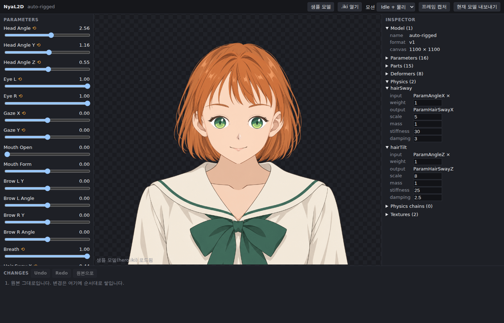

# 렌더링

## 프레임 파이프라인

**Confirmed** (`engine/src/player.ts`의 `renderFrame`, 엔진 README의 Rendering notes)

```text
requestAnimationFrame (IkiPlayer.start가 소유)
  │
  ├─ 캔버스 크기 = clientWidth × devicePixelRatio 로 맞춤
  ├─ clear (색 + 스텐실)
  ├─ 모델 캔버스를 드로잉 버퍼에 비율 유지로 맞춤 (fit = min(w/W, h/H))
  ├─ resolveDeformerWorlds   matrix 디포머: pivot·transform·바인딩 → 월드 아핀 (부모 체인)
  ├─ resolveWarpGrids        warp 디포머: 부모 아핀 + 격자 키폼(1D/2D) → 변형된 제어 격자
  └─ 파트를 order 순서로
       ├─ 바인딩 합산 → 파트 TRS, 불투명도
       ├─ 메시 파트: 정점 키폼 보간 → (워프 디포머 자식이면) 격자 샘플링 → 동적 VBO 업로드
       ├─ clip 있으면: 마스크 파트를 스텐실에 쓰고 그 안에만 그림
       └─ draw (WebGL2)
```

- 변형은 CPU에서 계산하고 결과 정점을 매 프레임 업로드한다.
- 파이프라인 전체가 프리멀티플라이드 알파다. 컨텍스트 `premultipliedAlpha: true`, 블렌드 ONE / ONE_MINUS_SRC_ALPHA.
- 클리핑은 스텐실 버퍼를 쓴다. 스텐실이 없으면 클리핑 없이 그리고 로그를 남긴다.
- 컨텍스트 옵션에 `preserveDrawingBuffer`가 없다 (기본값 false).
- 렌더러는 WebGL2 하나다. WebGPU 경로는 없다.

## 프레임 캡처

엔진에는 캡처 API가 없다. 앱이 캔버스를 직접 읽는다.

**Observed** (`app/scripts/smoke.mjs`, 결과 `app/observations/browser-smoke.json`)
- 캔버스를 `setTimeout`에서 `toDataURL()`로 읽으면 완전히 투명한 이미지가 나온다 (불투명 픽셀 0개).
- 다음 `requestAnimationFrame` 콜백 안에서 읽으면 렌더된 프레임이 그대로 나온다 (800×701 중 불투명 픽셀 약 24만 개).
- 파라미터를 바꾸면(`ParamAngleX` 0 → 30) 캡처 이미지가 달라지고, Idle 모션을 켜 두면 0.4초 간격 캡처 4장이 모두 다르다.

**Inference**
- `preserveDrawingBuffer: false`라 합성 후 버퍼가 비워지기 때문이다. 플레이어의 rAF 콜백이 먼저 등록되어 있으므로 같은 프레임의 뒤쪽 rAF 콜백에서 읽으면 방금 그린 버퍼를 읽는다. 앱의 `IkiRuntime.captureFrame()`이 이 방식을 쓴다.
- 이 순서는 rAF 콜백 등록 순서에 기대고 있다. 엔진이 렌더 루프 방식을 바꾸면 깨질 수 있으므로 스모크 테스트가 회귀 감지 역할을 한다.

## 화면 예시



headless Chromium(SwiftShader)에서 `hero.iki`를 로드한 화면. 왼쪽은 파라미터(⟲는 모션 드라이버가 쓰는 파라미터), 오른쪽은 인스펙터, 아래는 변경 목록.
